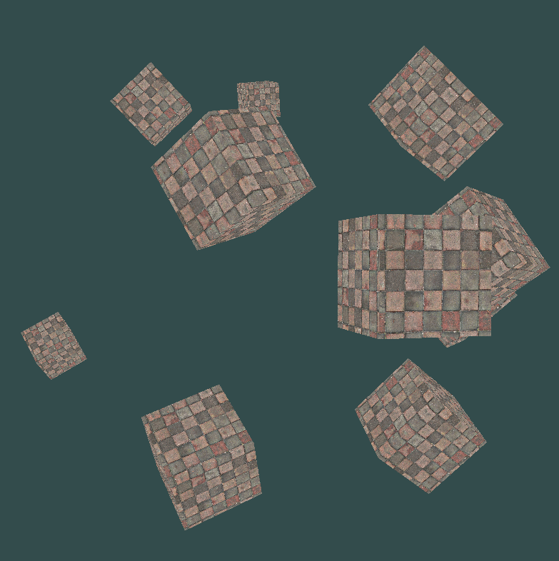

# OpenGL Game Engine

This repository contains an attempt to write a game engine with OpenGL with C++.
I barely know C++ and OpenGL, so with this project I'm learning those things.
I do however know GLSL, and how to calculate lighting and all the stuffs.

To learn OpenGL the following tutorial is used: https://learnopengl.com.

## Implemented

The following functionality has currently been implemented.

 * Set up for OpenGL where the render pipeline is set up, and rendering triangles.
 * Custom shaders that are compiled and used, with error messaging.
 * Support for loading and rendering textures.
 * A view-model-projection matrix in the vertex shader.
 * A camera model based on a position, target, and up vector.
 * Key handling to move the camera (WASD, Shift, Space, Esc).
 * Mouse handling for a 'FPS style' camera.
 * Mouse scrolling for zooming.

It currently renders 10 different cubes, which come from the same geometry, which is changed with the model matrix before rendering.

## Set up

If you set this up with Visual Studio:
 
 1. Open project settings
 2. VC++ Directories
 3. Add the `lib` and `includes` folder to the `Include Directories` and `Library Directories`.
 4. Goto to Linker Input
 5. Add the following additional dependencies: `glfw2.lib`, `opengl32.lib`.